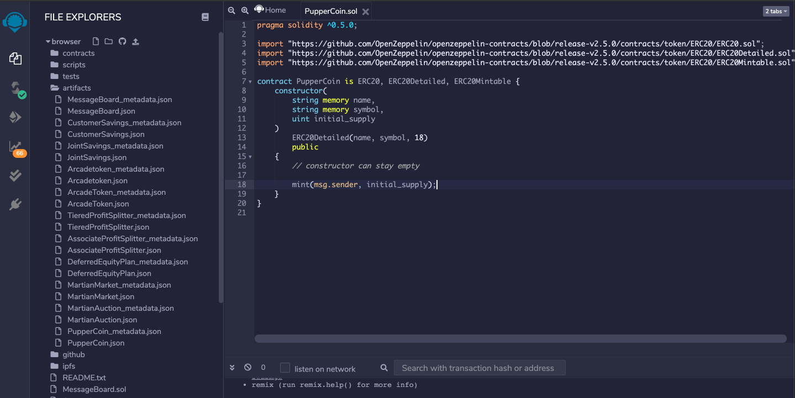
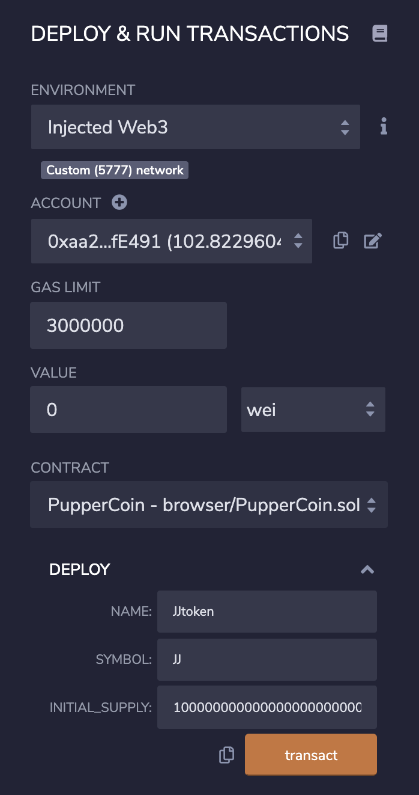
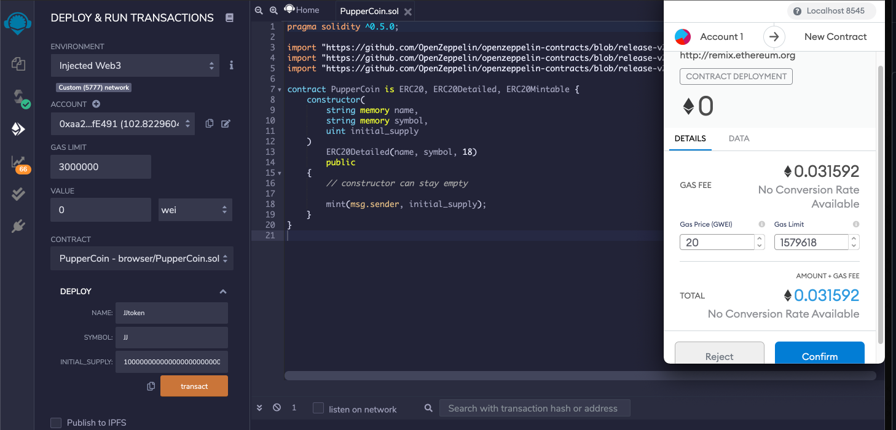
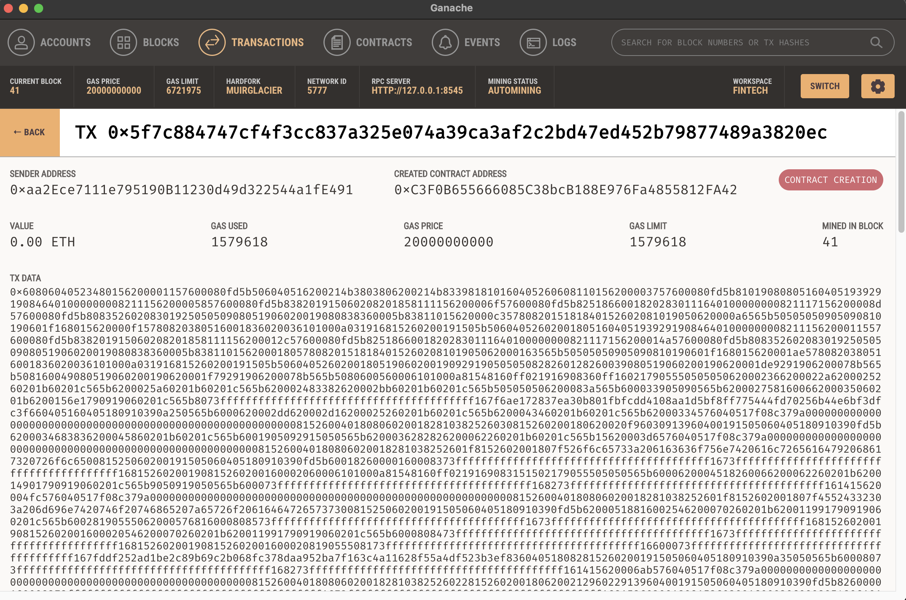

# Solidity-Crowdsale

 

### Background

Your company has decided to crowdsale their PupperCoin token in order to help fund the network development.
This network will be used to track the dog breeding activity across the globe in a decentralized way, and allow humans to track the genetic trail of their pets. You have already worked with the necessary legal bodies and have the green light on creating a crowdsale open to the public. However, you are required to enable refunds if the crowdsale is successful and the goal is met, and you are only allowed to raise a maximum of 300 Ether. The crowdsale will run for 24 weeks.

You will need to create an ERC20 token that will be minted through a Crowdsale contract that you can leverage from the OpenZeppelin Solidity library.

This crowdsale contract will manage the entire process, allowing users to send ETH and get back PUP (PupperCoin).
This contract will mint the tokens automatically and distribute them to buyers in one transaction.

It will need to inherit Crowdsale, CappedCrowdsale, TimedCrowdsale, RefundableCrowdsale, and MintedCrowdsale.

You will conduct the crowdsale on the Kovan or Ropsten testnet in order to get a real-world pre-production test in.

### Tools You Will Need

  - Remix IDE: http://remix.ethereum.org/
  - MetaMask: https://metamask.io
  - MyCrypto: https://mycrypto.com
  - Ganache: https://www.trufflesuite.com/ganache
  
### ERC20 PupperCoin

Puppercoin.sol smart contract was made to create the custom ERC20 token. This smart contract includes a OpenZeppelin contracts that were imported via GitHub that obtain the ERC20, ERCDetailed & ERC20Mintable smart contracts. The properties of this smart contract include a Constructor which includes the namen symbol and initial supply (18 decimals). 

1. Before you compile the smart contract should look like the following:

 

2. Once compiling is successfully completed, you must start to transact. Before you hit transact, you must change the environment to InjectedWeb3 to confirm the LocalTestNetwork within MetaMask. Under deploy, you will need to put in place the name of your token, symbol, and the initial supply amount. Then you can select transact. It should look like this:

 

3. Once you hit transact it should start to initialize the confirmation with MetaMask:

 

4. Once successfully completed the transaction on MetaMask, you can check Ganache to see the transaction: 

 

Once we successfully completed all the steps above. We move on to adding our custom coin to MetaMask!

### Adding JJtoken to MetaMask
